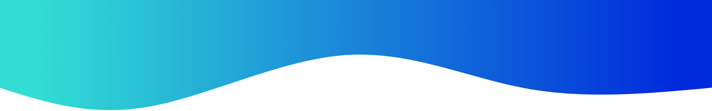
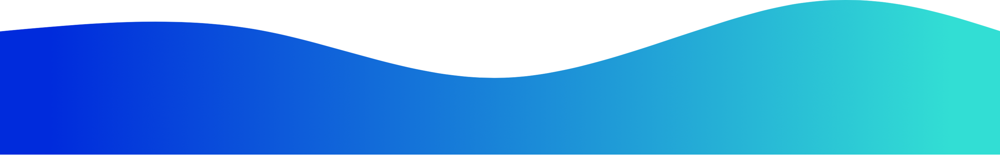

<h1 align="center">Hi , I'm Mohammed Rizin</h1>
<h3 align='center'>
    <samp>2nd Rank in Kaggle Competition in India (38th in Global)</samp>
    <samp>Kaggle Competition Master</samp>
     
    <samp>Youngest Data Scientist</samp>
</h3>

<ul align='center' style="list-style-type:none;">
    		I am a <b> High School Student </b> 
    <b> 	1st Place Winner</b> in  <a href="https://www.kaggle.com/c/vinbigdata-chest-xray-abnormalities-detection">VinBigData Chest- Xray Abnormalities Detection</a> 
    <b> 	2nd Place Winner</b> in  <a href="https://www.kaggle.com/c/bms-molecular-translation">Bristol-Myers Squibb – Molecular Translation</a>
</ul>

    <b>Connect</b> with me if you are into building <b>Machine Learning / Deep Learning Models, Data Science</b>, or just to say <b>"Hi"</b> 👋.

 

    
    &nbsp;
    
    &nbsp;
    

 

    
    

 

---

	&nbsp;&nbsp;&nbsp;&nbsp;&nbsp;&nbsp;&nbsp;
    
    &nbsp;&nbsp;&nbsp;&nbsp;&nbsp;&nbsp;&nbsp;
    &nbsp;&nbsp;&nbsp;&nbsp;&nbsp;&nbsp;&nbsp;
    &nbsp;&nbsp;&nbsp;&nbsp;&nbsp;&nbsp;&nbsp;
    &nbsp;&nbsp;&nbsp;&nbsp;&nbsp;&nbsp;&nbsp;
 

<!--h1 align="center">Activity</h1>
<h3 align='center'>
    <samp>Current Adventures</samp>
</h3>

 

<ul align='left' style="list-style-type:none;">
    <li>:zap: Learning Golang for fun.</li>
    <li>:trollface: Thinking about the Julia Hype Train</li>
    <li>:relaxed: Binging on Beethoven</li>
    <li>:cyclone: Confused on Kaggle</li>
</ul -->
